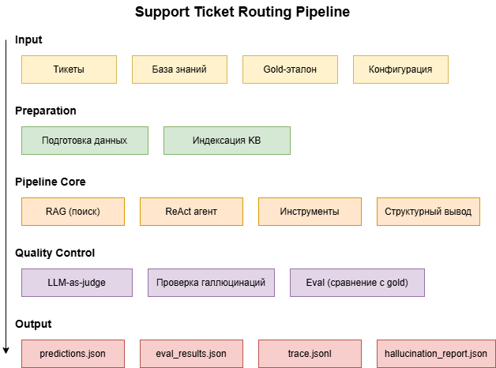

# Отчёт по проекту: Support Ticket Routing Pipeline

## 1. Задача и данные

### Задача

Построить конвейер для автоматической классификации и маршрутизации тикетов поддержки. Система должна определять:

- **Тип обращения** (Incident, Request, Problem, Change)
- **Отдел** для маршрутизации (Technical Support, Billing and Payments, IT Support и др.)
- **Приоритет** (low, medium, high, critical)
- **Теги** для дополнительной категоризации

### Данные

**Источник:** Customer IT Support Dataset (синтетические данные)

**Объём:**
- 28 589 тикетов в `input/tickets.csv`
- 50 документов в базе знаний (ответы агентов)
- 25 размеченных кейсов для оценки (`eval_gold.json`)

**Подготовка:**
1. Извлечение нужных колонок: `subject`, `body`, `answer`, `type`, `queue`, `priority`
2. Создание базы знаний из 50 ответов агентов
3. Формирование gold-набора из 25 случайных кейсов с ожидаемыми значениями

---

## 2. Система

### Архитектура

### Использованные техники курса (6)

| # | Техника | Реализация |
|---|---------|------------|
| 1 | **Структурированный вывод** | Pydantic-схемы в `schema.py` с `field_validator` |
| 2 | **RAG** | Hybrid RAG: BM25 + ChromaDB (embeddings) в `rag.py` |
| 3 | **Агент с инструментами** | ReAct-агент в `agent.py` с 3 инструментами |
| 4 | **LLM-as-judge** | Оценка по 5 критериям в `judge.py` |
| 5 | **Проверка галлюцинаций** | Поиск ghost-цитат в `hallucination.py` |
| 6 | **Eval с path-метриками** | Сравнение с gold в `eval.py` + замер шагов |

### Схема пути данных

1. Тикеты из `input/tickets.csv` поступают в `prepare_data.py` для создания KB и gold-набора
2. `rag.py` индексирует KB (BM25 + ChromaDB)
3. `pipeline.py` запускает агента для каждого тикета
4. `agent.py` вызывает инструменты: `classify_ticket`, `search_kb`, `check_escalation`
5. `tools.py` выполняет классификацию через LLM с few-shot примерами из KB
6. `schema.py` валидирует структуру через Pydantic
7. `hallucination.py` проверяет наличие ghost-цитат
8. `judge.py` оценивает качество анализа
9. `eval.py` сравнивает предсказания с gold и сохраняет метрики

---

## 3. Оценка

### Набор для оценки

- **25 кейсов** из `eval_gold.json`
- Каждый кейс содержит: текст тикета и ожидаемые значения (type, queue, priority, tags)

### Метрики

| Метрика | Значение |
|---------|----------|
| **type_accuracy** | 72% |
| **queue_accuracy** | 24% |
| **priority_accuracy** | 24% |
| **tags_accuracy** | 8% |
| **hallucination_pass_rate** | 100% |
| **judge_pass_rate** | 96% |
| **overall_pass_rate** | 8% |

### Path-метрики

| Параметр | Значение |
|----------|----------|
| **Среднее число шагов** | 3.0 |
| **Используемые инструменты** | classify_ticket, search_kb, check_escalation |
| **Модель** | llama3.2:3b (локально через Ollama) |

### Интерпретация

- **hallucination_pass_rate = 100%** — модель не выдумывает цитаты
- **judge_pass_rate = 96%** — LLM-судья считает анализ качественным
- **queue_accuracy = 24%** — в KB всего 50 документов, недостаточно примеров для всех отделов
- **priority_accuracy = 24%** — модель почти всегда ставит `medium`, потому что в KB мало примеров для `high` и `low`

Низкие метрики связаны с тем, что:
1. Используется маленькая локальная модель (`llama3.2:3b`)
2. В KB всего 50 документов — недостаточно для покрытия всех отделов и приоритетов
3. Модель консервативна в выборе приоритета

---

## 4. Где пайплайн ошибался

### Пример 1: Неправильный отдел

**Вход:** `Customer requests detailed information about product features and documentation`
**Ожидаемый отдел:** `Product Support`

**Модель вернула:** `Technical Support`

**Причина:** В KB нет примеров для `Product Support`, модель не знает этот отдел

---

### Пример 2: Неправильный приоритет

**Вход:** `Simple billing question about payment cycle`
**Ожидаемый приоритет:** `low`

**Модель вернула:** `medium`

**Причина:** В KB мало примеров с `low` приоритетом, модель выбирает `medium` по умолчанию

---

### Пример 3: Неправильный тип

**Вход:** `Request for configuration updates to improve marketing strategies`

**Ожидаемый тип:** `Change`

**Модель вернула:** `Request`

**Причина:** В KB нет примеров для `Change`, модель не различает `Request` и `Change`

---

## 5. Выводы

### Ответ на задачу

Конвейер успешно обрабатывает тикеты: выполняет классификацию, проверяет галлюцинации и оценивает качество. Система демонстрирует все 6 техник курса в работе.

### Границы применимости

1. **Модель** — локальная `llama3.2:3b` ограничивает точность. Для улучшения качества нужна более крупная модель (например, `qwen2.5:7b`).
2. **База знаний** — 50 документов недостаточно для покрытия всех случаев. Увеличение KB повысит точность, но замедлит поиск (линейный рост времени на каждый дополнительный документ).
3. **Язык** — модель работает с английскими и немецкими текстами, но качество зависит от языка.
4. **Приоритеты** — модель консервативна и требует усиленной rule-based проверки.

### Что можно улучшить

1. Заменить модель на `qwen2.5:7b` или `llama3.2:7b`
2. Расширить базу знаний до 200-500 документов (при этом скорость поиска снизится пропорционально)
3. Добавить больше метаданных в KB для всех отделов и приоритетов
4. Улучшить rule-based проверку для приоритетов
5. Привести gold-стандарт к названиям отделов, которые использует модель

### Компромисс: точность vs скорость

| KB (документов) | Точность (ожидаемая) | Скорость поиска |
|-----------------|----------------------|-----------------|
| 50 (сейчас) | Низкая | Быстро |
| 200 | Средняя | Средне |
| 500 | Высокая | Медленно |

Увеличение KB до 200-500 документов повысит точность, но увеличит время обработки каждого тикета. Для продакшена нужен баланс между точностью и скоростью.

---

## Артефакты прогона

- `output/predictions.json` — предсказания по 25 тикетам
- `output/eval_results.json` — метрики оценки